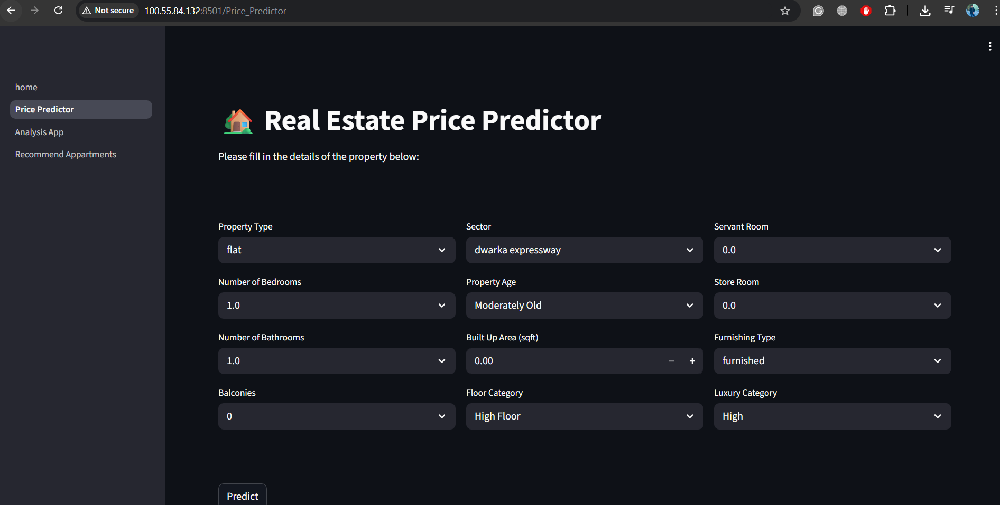
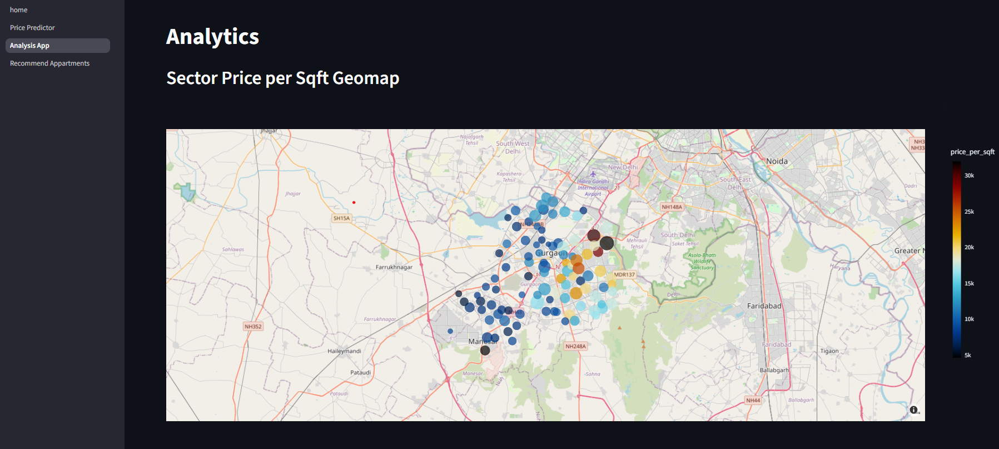
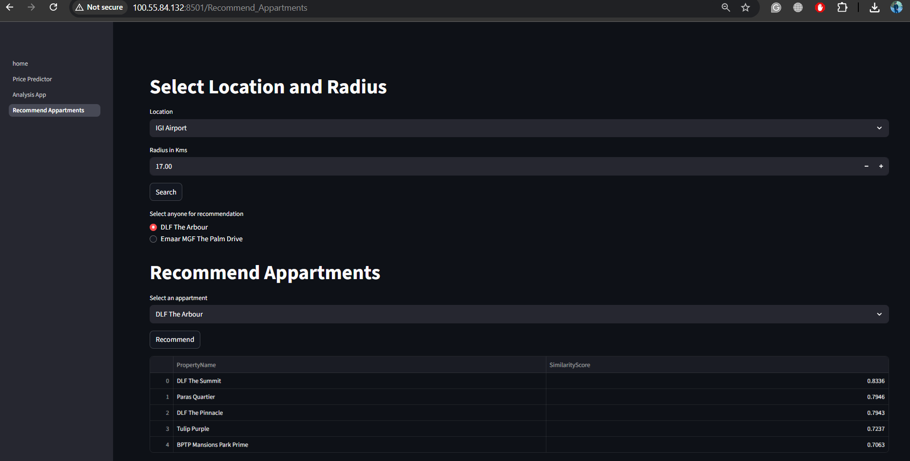

# 🏡 Real Estate Price Prediction & Recommendation System

### 📌 Project Roadmap

A full **end-to-end machine learning system that predicts property prices and recommends** similar listings based on user preferences. Built using Python, Scikit-learn, XGBoost, and deployed via Streamlit on AWS EC2.

--- 

## Project Modules

### 1. Price Prediction
Predicts property prices based on structured features using an ensemble ML pipeline.

   * Data Preprocessing
   * Exploratory Data Analysis (EDA)
   * Feature Selection & Feature Engineering
   * Model Training
   * Streamlit App
   

### 2. Analytics & Visualization
Provides interactive data insights through the following visualizations:

   * Geo Map visualization
   * Word Cloud of Amenities
   * Scatter Plot (Area vs Price)
   * Pie Chart (BHK filtered by Sector)
   * Side-by-Side Box Plot (Bedrooms vs Price)
   * Distribution Plot of Prices (Flats & Houses)
   

### 3. Recommendation System
Recommends similar properties based on user-defined criteria:

   * Recommend properties based on user-selected location & search radius
   * Enable users to select properties from filtered results
   * Generate similar property recommendations based on selected apartment features
   

---

## 1️⃣ Project Planning

**Problem Statement:** Predict property prices accurately based on features like location, area, bedrooms, bathrooms, furnishing, and age, and provide recommendations for similar properties.

**Objectives:**

- Achieve an R² score above 0.85 for price prediction
- Evaluation metrics: R², RMSE, MAE
- Recommendation relevance measured via cosine similarity


## Tech Stack

| Category | Tools |
|---|---|
| Data Handling | Python, Pandas, NumPy |
| Visualization | Matplotlib, Seaborn, Plotly, Folium |
| Machine Learning | Scikit-learn, XGBoost, LightGBM, CatBoost |
| Hyperparameter Tuning | Optuna, GridSearchCV |
| Recommendation | TF-IDF Vectorizer, Cosine Similarity |
| Deployment | Streamlit, AWS EC2 |

---


## 2️⃣ Data Gathering

* Get flat and house raw datasets from Kaggle

---

## 3️⃣ Data Preprocessing

* Check null and duplicate values in each column
* Drop unnecessary columns
* Rename all columns to the same format
* Remove words and special characters from the `society` column
* Clean the `price` column and remove incorrect values
* Convert values from lakh to crore in price column
* Remove letters and symbols from the `price_per_sqft` column
* Remove words from the `bathroom`, `balcony`, and `bedroom` column
* Fix the `floor_num` column to maintain consistent values
* Create a new column area `using`:
    * df['area'] = (df['price'] * 10000000) / df['price_per_sqft']
* Created New Column: sector
* Identified sector patterns from property names using online research
* Combined both flats and houses datasets into a single dataset.

---

## 4️⃣ Exploratory Data Analysis (EDA)

### Univariate Analysis

* Analyze each feature individually for distribution, skewness, outliers, and category frequency

### Bivariate Analysis

* property_type vs price, built_up_area, price_per_sqft, floorNum, agePossession, furnishing_type, luxury_score, sector
* bedroom vs price
* agePossession vs price
* furnishing_type vs price

### Visualization Techniques

* Bar Plot → Comparison of average values between categories
* Pie Chart → Distribution of categorical variables
* Histogram (Histplot) → Distribution of numeric variables
* Box Plot → Spread, median, and outlier detection
* Scatter Plot → Relationship between two numeric variables
* Heatmap → Correlation analysis between numerical features
---

## 5️⃣ Feature Engineering

* **areaWithType column:** 
    * The areaWithType column contained mixed textual information such as: Super Built-up Area, Built-up Area, Carpet Area, Values in sq.m. and sqft
    * Extracted Super Built-up Area, Built-up Area, and Carpet Area into separate columns.
    * Converted all area measurements from square meters (sq.m.) to square feet (sqft) for consistency.

* **additionalRoom column:** 
    - The additionalRoom column contained textual descriptions of extra rooms.
    - Created binary indicator columns for each room type.

* **agePossession column:** 
    - Raw age values were grouped into meaningful categories to improve interpretability.
    - 0–1 Year Old → New Property
    - 1–5 Years Old → Relatively New
    - 5–10 Years Old → Moderately Old

* **furnishDetails column:** 
    - The furnishDetails column contained multiple furnishing items in text format.
    - Extracted individual furnishing items (AC, Wardrobe, Geyser, etc.).
    - Converted furnishing details into numerical features.
    - Applied KMeans clustering to group properties based on furnishing intensity.

* **Outlier Handling:** Outliers in price_per_sqft, price, area, bedroom, bathroom, balcony, built_up_area, carpet_area, and luxury_score were identified using histograms and box plots. 
    - Extreme values were removed using the IQR method to ensure realistic and consistent data. This cleaned dataset improved analysis and model accuracy.

* **Feature Transformation:**
    - Create `luxury_category` (low, medium, high) from luxury_score by assigning score ranges
    - Create `floor_category` (low, mid, high) from floorNum by assigning numeric ranges
    - Apply OrdinalEncoder on all categorical columns to convert them into numeric form


* **Missing Values:** 
    - Fill missing `built_up_area` using `super_built_up_area` and `carpet_area`.
    - Impute missing `floorNum` with the median value.
    - Fill missing `agePossession` using mode based on `property_type` and sector.

* **Feature Selection:** Used multiple feature selection methods: heatmaps to check correlations, RandomForest/GradientBoosting and permutation importance to rank features by impact, LASSO and RFE to select important linear predictors, SHAP to interpret contributions, and VIF to detect and remove multicollinearity—this way, I keep features that are both predictive and non-redundant.

---

## 6️⃣ Model Training

* **6.1. Model Training with OrdinalEncoder:**
    - Apply StandardScaler on all numerical columns
    - Apply OrdinalEncoder on all categorical columns
    - Train multiple models (LinearRegression, SVR, Ridge, LASSO, DecisionTreeRegressor, RandomForestRegressor, ExtraTreesRegressor, GradientBoostingRegressor, AdaBoostRegressor, MLPRegressor, XGBoostRegressor, etc.) using a model trainer pipeline


* **6.2. Model Training with OneHotEncoder:** 
    - Apply StandardScaler on all numerical columns
    - Apply OrdinalEncoder on all categorical columns
    - Apply OneHotEncoder on sector, agePossession, and furnishing_type columns
    - Train multiple models (LinearRegression, SVR, Ridge, LASSO, DecisionTreeRegressor, RandomForestRegressor, ExtraTreesRegressor, GradientBoostingRegressor, AdaBoostRegressor, MLPRegressor, XGBoostRegressor, etc.) using a model trainer pipeline


* **6.3. Model Training with OneHotEncoding With PCA** 
    - Apply StandardScaler on all numerical columns
    - Apply OrdinalEncoder on all categorical columns
    - Apply OneHotEncoder on sector, agePossession, and furnishing_type columns
    - Train multiple models (LinearRegression, SVR, Ridge, LASSO, DecisionTreeRegressor, RandomForestRegressor, ExtraTreesRegressor, GradientBoostingRegressor, AdaBoostRegressor, MLPRegressor, XGBoostRegressor, etc.) using a model trainer pipeline with PCA for dimensionality reduction.


* **6.4. Model Training with Target Encoder** 
    - Apply StandardScaler on all numerical columns
    - Apply OrdinalEncoder on all categorical columns
    - Apply OneHotEncoder on agePossession, and furnishing_type columns
    - Apply TargetEncoder on sector column
    - Train multiple models (LinearRegression, SVR, Ridge, LASSO, DecisionTreeRegressor, RandomForestRegressor, ExtraTreesRegressor, GradientBoostingRegressor, AdaBoostRegressor, MLPRegressor, XGBoostRegressor, etc.) using a model trainer pipeline.


* **6.5. Model Training and Hyperparameter Tuning of XGBRegressor using GridSearchCV** 
    - Apply StandardScaler on all numerical columns
    - Apply OrdinalEncoder on all categorical columns
    - Apply OneHotEncoder on agePossession, and furnishing_type columns
    - Apply TargetEncoder on sector column
    - Perform hyperparameter tuning on XGBRegressor using GridSearchCV with K-Fold cross-validation

* **6.6. Model Training and Hyperparameter Tuning of RandomForestRegressor using GridSearchCV** 
    - Apply StandardScaler on all numerical columns
    - Apply OrdinalEncoder on all categorical columns
    - Apply OneHotEncoder on agePossession, and furnishing_type columns
    - Apply TargetEncoder on sector column
    - Perform hyperparameter tuning on RandomForestRegressor using GridSearchCV with K-Fold cross-validation


* **6.7. Model Training with Hyperparameter Tuning of XGBRegressor using Optuna** 
    - Apply StandardScaler on all numerical columns
    - Apply OrdinalEncoder on all categorical columns
    - Apply OneHotEncoder on agePossession, and furnishing_type columns
    - Apply TargetEncoder on sector column
    - Perform hyperparameter tuning on XGBRegressor using optuna with K-Fold cross-validation

### Model Performance
| Model             | R² Score |
| ----------------- | -------- |
| XGBoost           | 0.895363 |
| Random Forest     | 0.894314 |
| Extra Trees       | 0.893840 |
| Gradient Boosting | 0.883504 |
| MLP               | 0.875769 |
| SVR               | 0.863043 |
| Linear Regression | 0.854616 |
| Ridge             | 0.854922 |
| Decision Tree     | 0.813924 |
| AdaBoost          | 0.814281 |
| LASSO             | 0.059434 |

> XGBoost with Optuna-tuned hyperparameters achieved the best performance, exceeding the R² > 0.85 target.


---

## 7️⃣ Recommender System
Properties are recommended based on three feature groups: TopFacilities, PriceDetails, and LocationAdvantages.

- Used TopFacilities, PriceDetails, and LocationAdvantages for the recommendation system.
- Converted text columns into strings.
- Applied vectorization using TF-IDF (TfidfVectorizer) on each text column.
- Calculated cosine similarity to measure similarity between properties.
- To evaluate the recommendation system performance:
    - Checked recommendations manually using domain knowledge.
    - Wrote a script to evaluate performance using mathematical metrics (e.g., similarity scores).
    - Collected and analyzed user reviews/feedback.
---

## 8️⃣ AWS EC2 Deployment

1. Launch EC2 instance
2. SSH to instance:

   ```bash
   ssh -i "path_to_key.pem" ubuntu@YOUR-EC2-IP
   ```
3. Update & install dependencies:

   ```bash
   sudo apt update && sudo apt upgrade -y
   sudo apt install python3 python3-pip -y
   pip3 install streamlit
   ```
4. Transfer project files
5. Install requirements:

   ```bash
   pip3 install -r requirements.txt
   ```
6. Run Streamlit app:

   ```bash
   export PATH=$PATH:/home/ubuntu/.local/bin
   streamlit run home.py
   ```

---

## 🚀 Points of Improvement

* Add advanced analytics & visualizations
* Expand to multiple cities
* Include independent/residential plots & commercial properties
* Improve predictive models with better algorithms
* Add more features & apply MLOps practices

---
